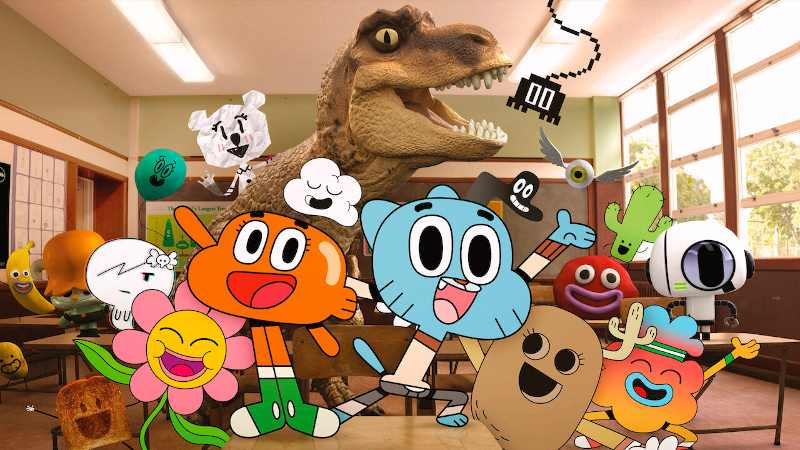
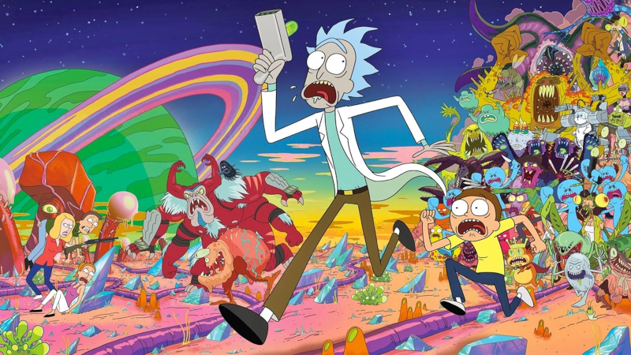

# Umami Gugus
**Documento de concepto**

Versión 1.0.0 - 11/07/24

Por **Julián Ábrego**

## Visión general

#### Un renglón
Administrador de tiempo y recursos donde el jugador controla a un alien cocinero que debe alimentar a niños hambrientos en un campamento.

#### Un párrafo
Umami Gugus es un juego de gestión de tiempo y recursos en el que el jugador controlará a un cocinero alienígena que tiene que cocinar en una parrilla de un campamento para niños que se enojan cuando les da hambre, poniéndose muy agresivos al punto de atacar al cocinero. El jugador debe balancear la cocción de los alimentos regulando la potencia del fuego y recolectando recursos de diferentes fuentes. El arte grotesco y humorístico del juego lo hace visualmente atractivo y divertido.

### Características principales

#### Estrategia, toma de decisiones y velocidad
Los ansiosos alienígenas que se acercan a recibir la comida que el jugador debe cocinarle obligarán al jugador a mantenerse alerta y gestionar tanto los materiales para cocinar como la potencia con la que los cocina

#### Variedad de naturaleza de los recursos
Las materias primas con las que el jugador debe preparar los alimentos será de lo más variada y animada. Algunos recursos simplemente deberán ser recogidos de una heladera, mientras que otros deberán ser cultivados y algunos hasta perseguidos y atrapados, incluso mientras se están cocinando.

#### Arte grotesco y humorístico
Los personajes y escenarios despliegan una variedad de colores y animaciones particularmente llamativas y graciosas. Las reacciones inesperadas de los comensales y materias primas despertarán más de una risa en los jugadores.

### Background
Umami Gugus se inspira en juegos como Overcooked, pero dándole un giro único al incluir elementos grotescos y humorísticos en su arte, y añadiendo una capa extra de desafío con la gestión del fuego y la recolección de recursos.

### Audiencia y Tecnologías soportadas
Umami Gugus está dirigido a jugadores jóvenes que disfrutan de juegos ágiles de gestión y estrategía, y que disfrutan del humor grotesco y absurdo. Su temática y estilo visual puede resultar llamativo para niños más pequeños, pero la complejidad de la gestión de recursos y el ritmo rápido del juego están diseñados para desafiar a jugadores de edades entre 10 y 18 años.
El juego se desarrollará exclusivamente para PC.

### Historia
El jugador controlará a Gugus, un alienígena cocinero que ha sido contratado para cocinar en un campamento espacial para niños. Estos niños tienen un apetito voraz que, combinada con su paciencia limitada, genera que Gugus se vea obligado a trabajar rápidamente para evitar el caos en el campamento. A medida que Gugus avanza en su trabajo, va adquiriendo mayor variedad de recursos, recetas y habilidades, lo que le permite participar en los famosos torneos intergalácticos de cocina y ganando reputación como chef. Su objetivo principal es el de participar del famoso campeonato organizado por la Familia Real Intergaláctica y ganar el primer lugar, para ser seleccionado como su chef y mantenerlos bien alimentados y de buen humor para mantener la paz en el universo.

### Arte
El arte es grotesco y humorístico, con personajes y escenarios visualmente llamativos y graciosos. Los diseños son exagerados y coloridos, con animaciones exageradas y cómicas. Está inspirado en los diseños de caricaturas como “Rick y Morti”, “El increíble mundo de Gumball”, entre otros.

*El ingreíble mundo de Gumball*

*Rick y Morti*

### Música
La música es alegre y dinámica, con temas que reflejan el frenesí de la cocina y el humor del juego. Cada nivel tiene su propio tema musical que se adapta a la dificultad y el entorno. La sonoridad está caracterizada por sintetizados y combinaciones tímbricas que emulan atmósferas espaciales.

## Gameplay

### Objetivos

#### Objetivo 1
Mantener el campamento en orden garantizando la buena alimentación de los niños alienígenas, cocinando rápidamente lo que ellos necesiten. 

#### Objetivo 2
Desarrollar nuevas habilidades culinarias y aprender recetas más complejas para desbloquear técnicas avanzadas, recolectar ingredientes raros y mejorar el equipo de cocina, para poder participar en desafíos y torneos cada vez más difíciles y mejorar así la reputación como chef de Gugus.

#### Objetivo 3
Ganar el famoso campeonato de cocina organizado por la Familia Real Intergaláctica, habiendo antes superado una serie de torneos intergalácticos y demostrado la habilidad como cocinero frente a los mejores chefs del universo, y ser elegido como el chef principal de la Familia Real.

### Gameplay
El jugador controla a Gugus desde una perspectiva top-down, moviéndose en ocho direcciones para recoger ingredientes, regular el fuego de las parrillas y cocinar los alimentos. Los recursos se recolectan de diversas maneras, algunos simplemente se recogen, mientras que otros requieren ser perseguidos y atrapados. Las parrillas tienen múltiples secciones con fuegos independientes, cada uno de los cuales debe ser regulado para cocinar los alimentos adecuadamente.

### Personajes protagonistas 
#### Gugus
El alienígena cocinero protagonista, encargado de gestionar la cocina y la paz del campamento

#### Niños alienígenas
Los comensales impacientes que se enojan cuando no reciben la comida que esperan y se pelean entre ellos y con el cocinero
Los mejores chefs del universo
Son los contrincantes de los torneos intergalácticos. Tienen sus propias recetas y habilidades especiales con las que pondrán al jugador en apuros

### Controles
#### Movimiento
Flechas direccionales del teclado o el joystick para mover a Gugus

#### Interacción
Botón de acción para recoger y depositar recursos, manejar la parrilla y entregar los alimentos

### Justificación
La combinación de la mecánica de gestión de tiempo y recursos con elementos de humor absurdo y grotesco resultan en una experiencia divertida y desafiante que captura la atención del jugador. La variedad de elementos con los qué cocinar y las solicitudes de los comensales fomentan la creatividad del jugador y ofrecen rejugabilidad. A esto se suma los desafíos crecientes de los campeonatos intergalácticos y los combates de cocina con los otros cocineros del universo. Todos estos elementos resultan atractivos para una amplia audiencia con ganas de divertirse y desafiarse. 
